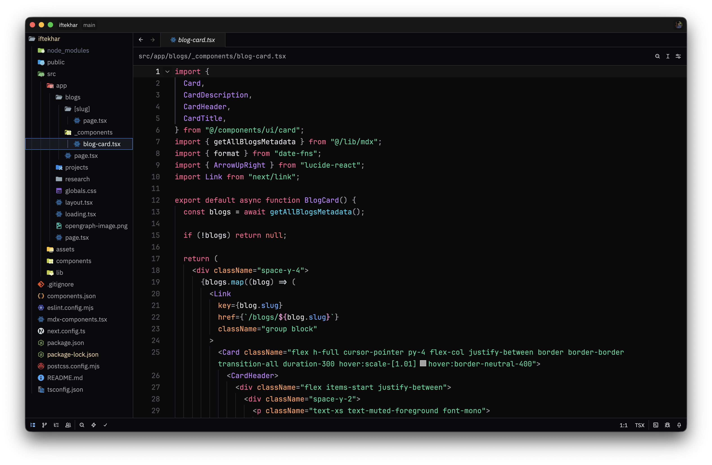
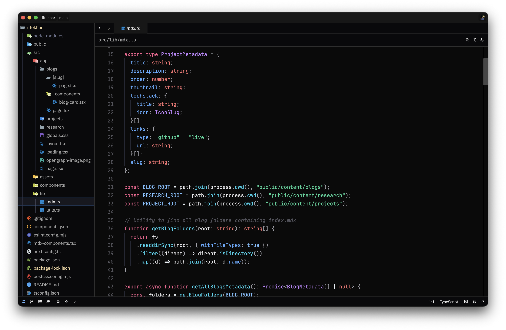

# Optima Theme

A dark minimal (opinionated) theme for [Zed](https://zed.dev) editor. Clean colors with a focus on readability and editor aesthetics.

## Screenshots

### Example 1

### Example 2

## Installation

1. Open Zed editor
2. Go to **Settings** → **Theme**
3. Search for "Optima"
4. Select "Optima Dark" and apply

## Theme Details

**Name:** Optima Dark  
**Appearance:** Dark

The theme uses a carefully balanced color palette:

- Background: Dark near-black with subtle variations
- Text: Light gray for comfortable reading
- Accents: Muted tones for UI elements and selections
- Syntax highlighting: Complementary colors for different code elements

## License

[MIT License](LICENSE)

---

Created for [Zed](https://zed.dev) editor
